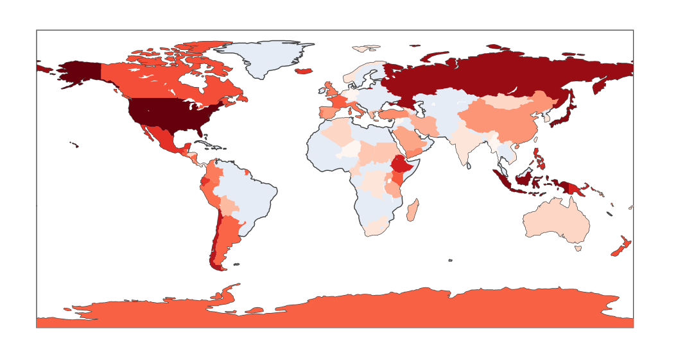

# COMP0034 Coursework 1

##Repository
https://github.com/ucl-comp0035/comp0034-cw1-i-KhalidAgha20

##Visualizations
### Visualization 1: Shaded world maps
#### Which countries have the most volcanoes and eruptions?
This visualization is tailored towards scientists interested in volcanoes and discovering the most volcano dense areas 
on our planet. This will most probably be professionals with a very serious mindset. Data must be delivered accurately
and efficiently.

The given data set includes a list of volcanoes and eruptions along with their respective countries. This data can be
used to count the number of volcanoes for each country along with their past eruptions. The most efficient way to
display this data is through shaded world maps or choropleth. The webapp is about volcanoes, so it is important to
set the mood for the visitor. Thus, it is planned to use a dark red theme for the website. Hence, the visualizations
must also follow suit. The shading on the visualizations will range from dark red all the way to a very light shade of
red (or pink). This will provide data to the users immediately and leave them excited to explore more.

#### Visualization Review

The visualizations almost matches the original plan. It has the required theme and displays the right data. The problem
the figure is that the countries with no data still appear in the chart. It would be better if they could be more
transparent.

### Visualization 2: Bar charts showing the countries with most eruptions and volcanoes
#### Which countries have the most volcanoes and eruptions?
This visualization will be intended to deliver some quick facts about the top 10 countries with most volcano's and 
eruptions. It is mainly intended to accompany another visualization 1 and act as a support to it. Hence, it has the same
target audience as visualization 1 and will follow the same design aspects.

The data used for this visualization is the same as its predecessor, the only difference being that visualization 2 only
uses 10 records. A sorted bar chart is one of the easiest ways to compare data which is why it is picked for this chart.
It will be minimalistic with little to no colors to bring the focus oif the user to the data only.

#### Visualization Review

This visualization exactly matches the description and demonstrates the data in a brilliant manner.

### Visualization 3: Line Graph Showing the trends with volcanic eruptions over time
#### Did the number of volcanic eruptions per year increase over time?
Scientists are interested in finding trends in difference places. During the data exploration phase, it was discovered
that the number of volcanic eruptions is on a content rise. This was a crucial factor into including this data into the 
final app. This graph once again is tailored towards experts which means the tone of the graph needs to be as 
informative as possible.

The current dataset includes data on eruptions for the past 2000 years. The data can be grouped to extract the number of
eruptions per year. Then the data is plotted into a simplistic line chart to show the trend. It is important that the
axes are not manipulated to avoid misinformation.

#### Visualization Review

The graph shows the trend of the dataset. However, it does it in a very poor manner. It would be preferred if the line
can be smoothened by plotting a line of best fit instead. This way, no confusions will take place regarding the figure.

### Visualization 4: Bar Graphs to Categorize the severity of eruptions
#### Did the severity of volcanic eruptions increase over time?
This figure is planned to accompany the previous one meaning they have the same audience. This visualization is focusing
on demonstrating how the severity, of volcanic eruptions changed over time. Volcanic Eruptions are given a number 
between 0-8. This is called the VEI and is used to measure their severity. The dataset includes this information which
means they can be easily plotted. 

A bar chart will be used. The x-axis will include all the VEI numbers. The bars will represent the number of eruptions
with each VEI. A slider will be included to switch the data between different years. This graph will also only include
bars with no background and black text only.

#### Visualization Review

The figure looks slight too vague. Maybe too simplistic. The plan for the final app is to make it more detailed and 
fitting yhe bars closer together. Furthermore, the slider could be started at a later date rather than 2000 years ago.

### Visualization 5: Obtaining the exact locations of volcanoes for individual countries
#### Where are the volcanoes located in a specific country and ae they dangerous?
Although the entire web app is meant to be used for serious matters, there needs to be soe visualizations which can be
used by everyone. This figure is intended to plot the location of individual volcanoes on the map. The users will be
allowed to pick between a list of countries and the visualization will automatically update. This is something
everyone finds interesting which means that this visualization can have a less serious theme.

The dataset contains the coordinates for volcanoes. These can be used to plot their locations on a world map. A mapbox
figure will be produced. The points on the map will be colored to demonstrate which volcanoes are the most active. This
is both informative and at the same time reduces some seriousness from the web app.

#### Visualization Review

The figure does a good job showing the locations. The best thing about it is the color coding which helps identify
dangerous volcanoes. This could be beneficial for tourists to avoid going to locations close to them.

### Visualization 6: Bar Graphs Showing the Population of people living close to volcanoes
#### Which countries have the most people living near volcanoes?
These types of number are crucial for the safety of the population. Volcanoes can erupt at any time leaving millions
of people stranded. This visualization is intended to be viewed by governments and people with influence. The figure
needs to be simple and provide a quick insight into the problem.

The given dataset already includes data on the number of people living in the vicinity of individual volcanoes. The data
set also includes the country each volcano is located in. This information can be used to categorize the populations by
countries rather than volcanoes. For ease interpretation, a familiar chart must be chosen which in this case is the bar
chart. Data for Countries will be included in alphabetical order to make it easier when searching for a specific
country. To provide a tone seriousness, a dark red colour will bve used for the color of the brs with black text only.
Excessive colors will be removed to bring all attention to the data rather than the "beauty" of the figures.

#### Visualization Review

The graph shows the required data brilliantly and as described. However, it can now be seen that it is slightly
confusing. Thus, the final app, will include a search bar which will give information on the country without the need to
look at the graph.

